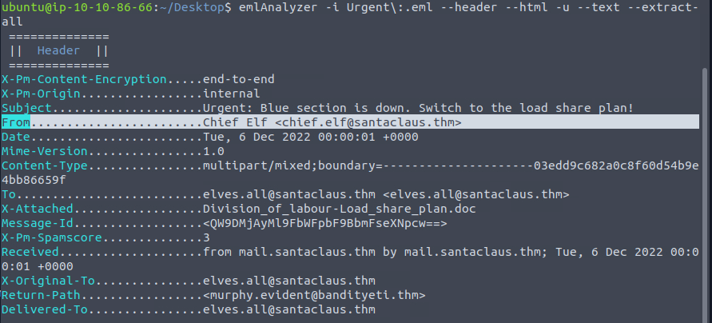
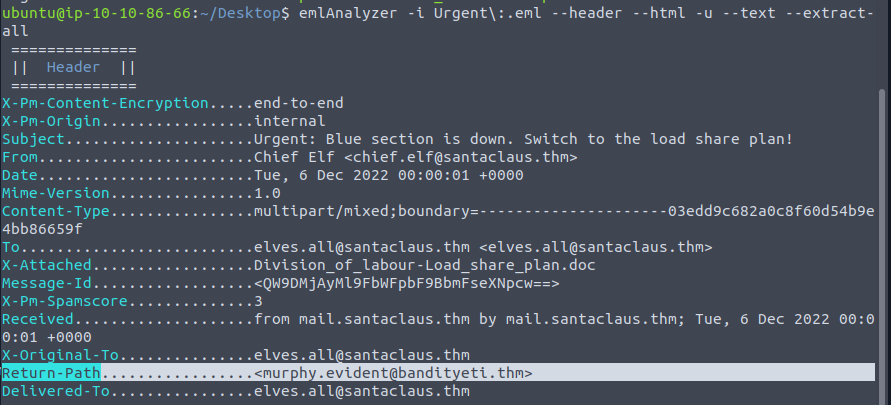
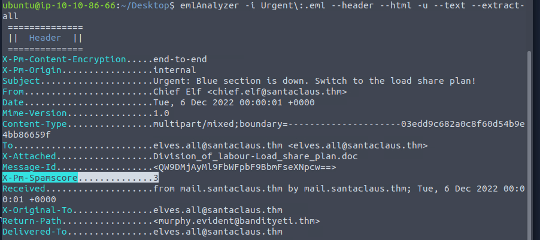
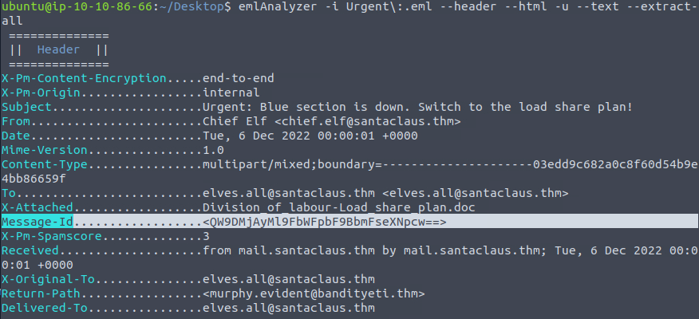
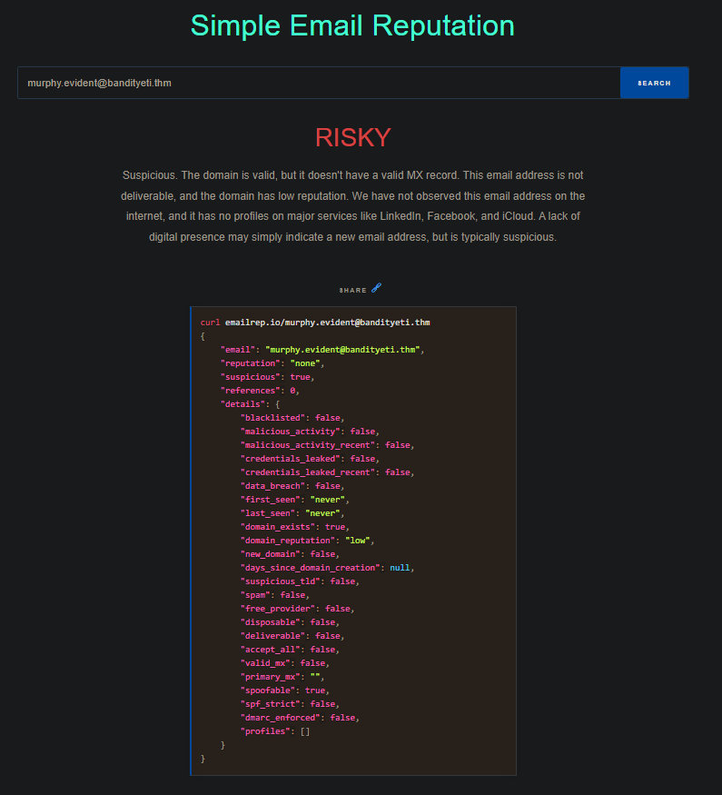
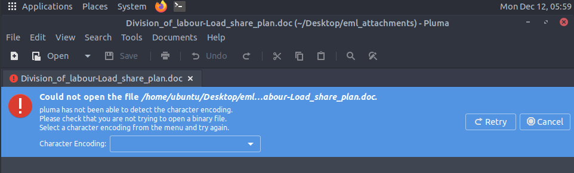
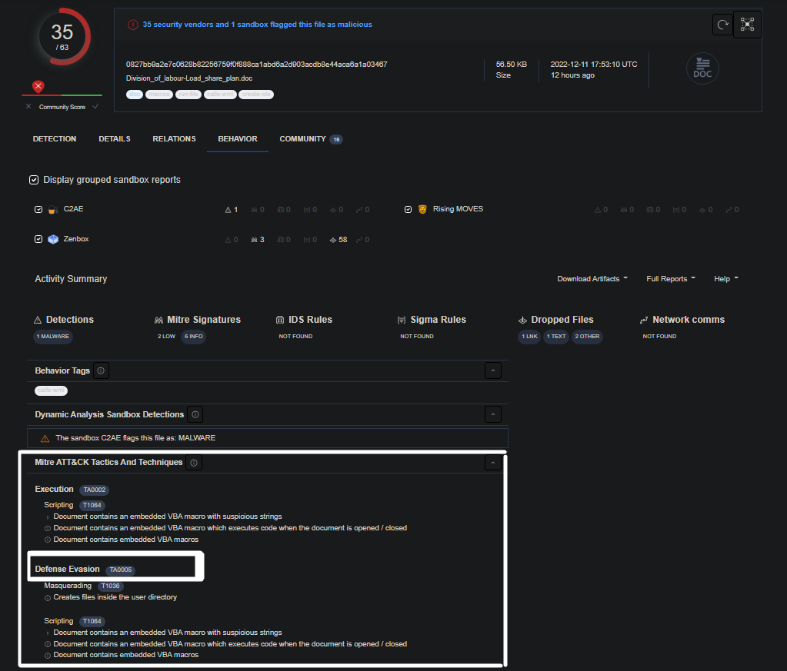
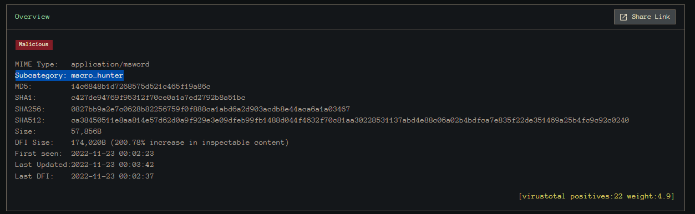

# Cyber Advent 2022 - Day 6 [<span style="color:blue;">Email Analysis</span>] [It's beginning to look a lot like phishing]

Day 6 of [tryhackme](https://tryhackme.com)'s [Advent of Cyber for 2022](https://tryhackme.com/christmas)! This challenge involves learning about phishing emails. This challenge provides in-depth information surrounding emails and how it works. 


#### Learning Objectives
- Learn what email analysis is and why it still matters.
- Learn the email header sections.
- Learn the essential questions to ask in email analysis.
- Learn how to use email header sections to evaluate an email.
- Learn to use additional tools to discover email attachments and conduct further analysis.
- Help the Elf team investigate the suspicious email received.

#### What is the email address of the sender?

Following the guide that TryHackMe showed us, we use the given command **after** we `cd` into the `Desktop` directory:

```bash
$ emlAnalyzer -i Urgent\:.eml --header --html -u --text --extract-all
```

Looking at the output of the `emlAnalyzer` command under the `Header` section we see:



**Answer:**
```
chief.elf@santaclaus.thm
```

#### What is the return address?

Looking at the output of the `emlAnalyzer` command under the `Header` section we see:



**Answer:**
```
murphy.evident@bandityeti.thm
```

#### On whose behalf was the email sent?

Looking at the output of the `emlAnalyzer` command under the `Header` section we see:


**Answer:**
```
Chief Elf
```

#### What is the X-spam score?

Looking at the output of the `emlAnalyzer` command under the `Header` section we see:



**Answer:**
```
3
```

#### What is hidden in the value of the Message-ID field?

Looking at the output of the `emlAnalyzer` command under the `Header` section we see:



Now we notice that the `Message-Id` is written in Base64 [you can tell by the length of the ID and the hexadecimal values given], from here we use a base64 decoder of our choosing. I google base64 decoder and [here](https://www.base64decode.org/) was the first link that I got. Now we only insert this: `QW9DMjAyMl9FbWFpbF9BbmFseXNpcw==` portion of the ID since the `<>` characters simply indicate the beginning and end of the ID. The answer is the output from the base64 decoder.

**Answer:**
```
AoC2022_Email_Analysis
```

#### Visit the email reputation check website provided in the task. What is the reputation result of the sender's email address?

We visit the [Email Reputation Analyzer](https://emailrep.io/) from the guide and enter the senders email: `murphy.evident@bandityeti.thm`



We see that the email is flagged as risky. 

**Answer:**
```
risky
```

#### Check the attachments. What is the filename of the attachment?

From the original `emlAnalyzer` command that we ran earlier, we can see in our `Desktop` folder that a new folder named `eml-attachments` has appeared after completing. From the terminal, we shall `cd` into that directory and look for the attachment name. Notice that if you attempt to open it that we get an error. The VM is hinting that the file may not be what it seems based on the error output.



**Answer:**
```
Division _ of _ labour-Load_share_plan.doc
```

#### What is the hash value of the attachment?

Now we will use the `sha256sum` to calculate the file's hash value. Below is the output of that command.

```
$ sha256sum Division _ of _ labour-Load_share_plan.doc
0827bb9a2e7c0628b82256759f0f888ca1abd6a2d903acdb8e44aca6a1a03467
```

**Answer:**
```
0827bb9a2e7c0628b82256759f0f888ca1abd6a2d903acdb8e44aca6a1a03467
```

#### Visit the Virus Total website and use the hash value to search. Navigate to the behaviour section. What is the second tactic marked in the Mitre ATT&CK section?

Following the instructions, we head over to [Virus Total](https://www.virustotal.com/gui/home/upload), click `Search` and paste the hash that we found above: `0827bb9a2e7c0628b82256759f0f888ca1abd6a2d903acdb8e44aca6a1a03467`. After navigating to the `behaviour` section we find the second tactic as seen below:



**Answer:**
```
Defense Evasion
```

#### Visit the InQuest website and use the hash value to search. What is the subcategory of the file?

Now we visit [InQuest](https://labs.inquest.net/) and pass the hash value [`0827bb9a2e7c0628b82256759f0f888ca1abd6a2d903acdb8e44aca6a1a03467`] into the `INDICATOR LOOKUP`. Click on view full details and we see the subcategory below:



**Answer:**
```
macro_hunter
```

## Authors

- [Shanks](https://github.com/HunterShanks)