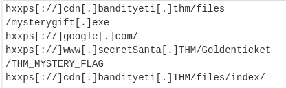

# Cyber Advent 2022 - Day 7 [<span style="color:blue;">CyberChef</span>] [Maldocs roasting on an open fire]

Day 7 of [tryhackme](https://tryhackme.com)'s [Advent of Cyber for 2022](https://tryhackme.com/christmas)! This challenge involves learning about 


#### Learning Objectives
- What is CyberChef
- What are the capabilities of CyberChef
- How to leverage CyberChef to analyze a malicious document
- How to deobfuscate, filter and parse the data

#### What is the version of CyberChef found in the attached VM?

Reading the VMs file path in the browser we see the version displayed.

**Answer:**
```
9.49.0
```

#### How many recipes were used to extract URLs from the malicious doc?

For the subsequent questions, all of them can be answered simply by following THM's CyberChef instructions. For this question, simply count the number of recipes under the `Recipe` panel.

**Answer:**
```
10
```

#### We found a URL that was downloading a suspicious file; what is the name of that malware?

Looking at the list of urls from our defang step we see:



Grab that malicious file name and submit!

**Answer:**
```
mysterygift.exe
```

#### What is the last defanged URL of the **bandityeti** domain found in the last step?

Looking at the last url from our defang step we see:


**Answer:**
```
hxxps[://]cdn.[.]bandityeti[.]thm/files/index/
```

#### What is the ticket found in one of the domains? (Format: Domain/<GOLDEN_FLAG>)


**Answer:**
```
THM_MYSTERY_FLAG
```

## Authors

- [Shanks](https://github.com/HunterShanks)