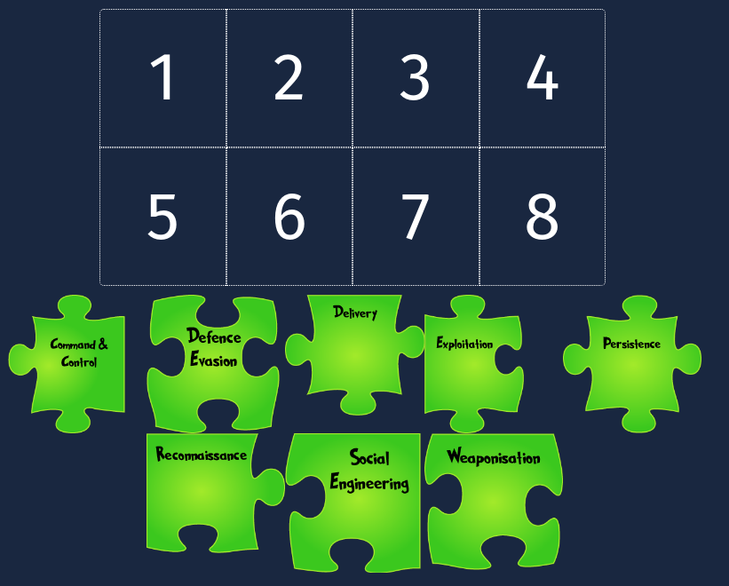
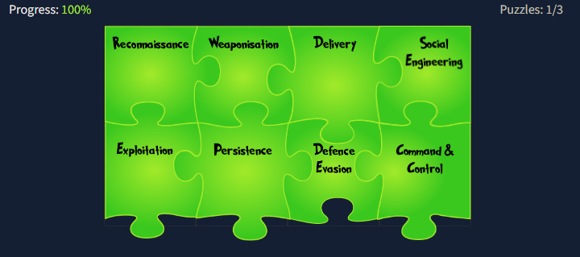
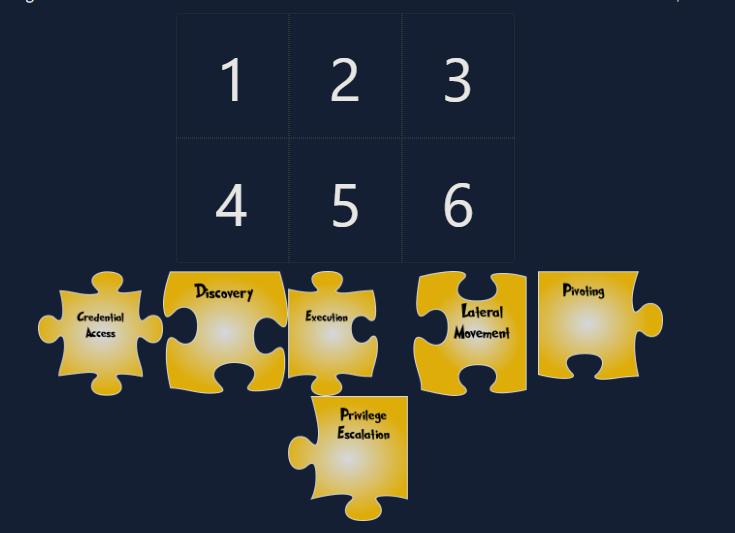
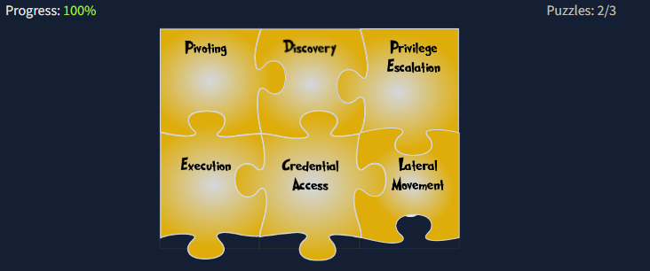
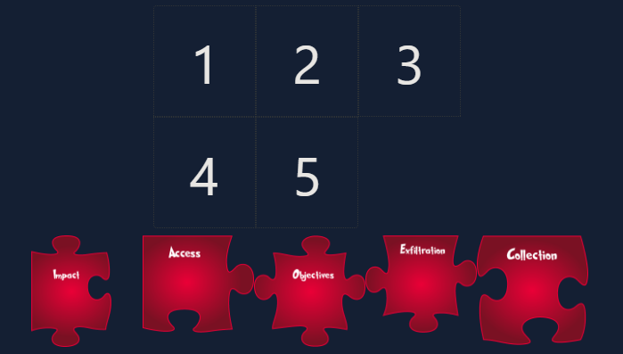
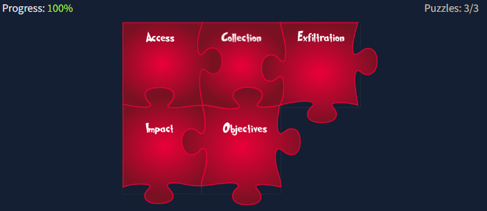

# Cyber Advent 2022 - Day 1 [Frameworks] [Someone's coming to town!]

Day 1 of [tryhackme](https://tryhackme.com)'s Cyber Advent for 2022! This challenge involves solving 3 puzzles that provide general outlines for various security frameworks. Each puzzle comes with a set of `clues` that will guide you to place the puzzle pieces in the correct order.

## Puzzle #1



Clues:

1. Research is part of my ask, finding clues in public sources.
2. Simple documents I turn into malware.
3. A pizza, parcel or payload all have me as an action in common.
4. A con is the name of my game, tricking you into believing a false identity.
5. Weaknesses are my go-to resources; through them, I make my presence felt.
6. I am set up to let you back into the network after you leave.
7. Deletion of evidence is part of my process.
8. Communication with the compromised goes through me.

### Solution



## Puzzle #2



Clues:

1. I am an anchor that lets you go on an adventure and explore.
2. With me, you can locate new information to expand the attack.
3. Once a pawn, I became a King.
4. My payloads are triggered to infect all they come in contact with.
5. Passwords I collect are the keys to the mainframe.
6. Side to side, machine to machine, we hop.


### Solution



## Puzzle #3



Clues:

1. In your vault, I am in.
2. Like a dragon, I gather all valuable loot.
3. I export gathered treasures.
4. With me, your reputation goes tumbling down.
5. Goals set, goals attained. I win!

### Solution



## Answer the questions below

Who is the adversary that attacked Santa's network this year?

```
The Bandit Yeti!
```

What's the flag that they left behind?

```
THM{IT'S A Y3T1 CHR1$TMA$}
```

## Authors

- [Shanks :yin_yang:](https://github.com/HunterShanks)